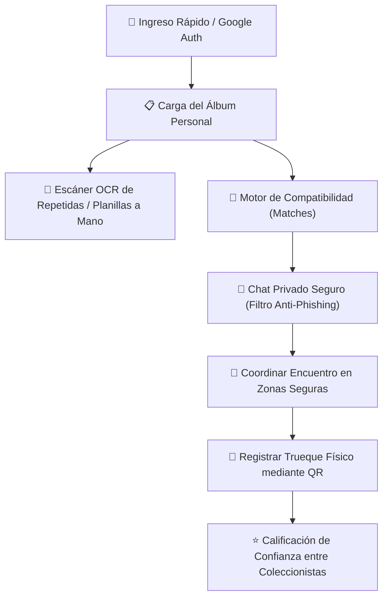

# 🧪 Análisis de Product Lab — FiguSwap Argentina

¡Qué hacés, crack! Te presento el análisis detallado del **Product Lab** para **FiguSwap Argentina**, la plataforma pensada para cambiar figuritas de forma segura y en tiempo real. En este documento evaluamos la experiencia de usuario (UX/UI), las funcionalidades clave, la seguridad de la base de datos y te dejamos recomendaciones impecables para llevar esta app al siguiente nivel.

---

## 🗺️ Visión del Producto y Flujo del Coleccionista

FiguSwap soluciona un problema histórico y recontra caótico: **el canje físico de figuritas**. Tradicionalmente, los coleccionistas dependían de planillas de papel imposibles de leer, grupos de WhatsApp desorganizados y encuentros peligrosos. FiguSwap digitaliza todo este proceso de forma segura y muy fluida.

### 🌟 Flujo Principal de Experiencia

---

## 🎨 Evaluación de Diseño y Experiencia de Usuario (UX/UI)

### 🟢 Puntos Fuertes
1. **Estilo Oscuro Premium**: El fondo oscuro (`neutral-950`) combinado con los tonos verdes (`emerald-400`) y amarillos (`amber-500`) le da una estética moderna, limpia y futbolera que te vuela la cabeza.
2. **Navegación Móvil de Primera**: La botonera inferior (`Inventario`, `Canjes`, `Chats`, `Zonas Seguras`) está perfectamente adaptada para pantallas móviles, ideal para usarla en la calle o en la plaza mientras cambiás figuritas.
3. **Feedback Visual Instantáneo**: Los bordes y colores interactivos según el estado de cada figu (`Lo Tengo`, `Falta`, `Repetida`) te permiten chequear tu progreso al toque de un vistazo.

### ⚠️ Oportunidades de Mejora
- **Progreso por Países**: La navegación por pestañas de los países funciona bárbaro, pero sumaría un montón ver una barrita de porcentaje o una métrica visual al lado de cada pestaña (ej: *Argentina 92%*).
- **Efectos de Glassmorphism**: Podríamos refinar los encabezados y la botonera con efectos de transparencia modernos utilizando `backdrop-blur-md bg-neutral-900/70 border-white/5`.

---

## ⚙️ Análisis de Funcionalidades y Salud Técnica

| Funcionalidad | Implementación Técnica | Fricción de Experiencia | Evaluación del Product Lab |
| :--- | :--- | :--- | :--- |
| **Control de Inventario** | Escucha en tiempo real con `onSnapshot` de Firestore en `App.tsx`. | **Muy Baja** (Sincroniza al instante). | **Excelente.** Súper dinámico y reactivo. Actualizar estados manualmente es una manteca. |
| **Escáner de Repes (OCR)** | Simulación de cámara con lectura inteligente de números y planillas escritas a mano. | **Media** (Requiere subir fotos). | **Una genialidad.** El escáner de planillas en papel le soluciona la vida a los coleccionistas de la vieja escuela. |
| **Motor de Compatibilidad** | Algoritmo que cruza vectores de figus faltantes y repes entre coleccionistas. | **Muy Baja** (Un botón para chatear). | **De lo mejor.** Resuelve el dolor de cabeza de buscar compatibilidad cruzada de forma automática. |
| **Chat con Filtro Anti-Phishing** | Mensajería protegida con reglas estrictas y filtrado en backend Express de enlaces sospechosos. | **Baja** (Chat clásico y fluido). | **Fundamental.** Protege a los más chicos y evita estafas o robos de cuentas fuera de la app. |
| **Zonas Seguras de Canje** | Mapa estático interactivo con los puntos de encuentro recomendados. | **Media** (Podría ser interactivo). | **Excelente utilidad.** Aporta muchísima tranquilidad física al momento de coordinar el canje en la plaza. |
| **Validador QR de Trueques** | Confirmación atómica que actualiza ambos álbumes cuando se encuentran cara a cara. | **Baja** (Escaneo rápido). | **Genera confianza total.** Evita avivadas: los dos tienen que escanear para que se compute el canje. |
| **Calificación de Confianza** | Sistema de reputación por estrellas y comentarios de trades pasados. | **Baja** (Un clic al terminar). | **Excelente.** Promueve que la comunidad se mantenga limpia de estafadores o impuntuales. |

---

## 🔒 Evaluación de Seguridad: Enfoque Zero-Trust

> [!IMPORTANT]
> Las reglas escritas en [firestore.rules](file:///c:/Users/domin/.gemini/antigravity/scratch/figu-swap/firestore.rules) son súper robustas. Evitan a la perfección las vulnerabilidades descritas en la especificación:
> - **Autoverificación Maliciosa**: Un usuario común jamás podrá autoproclamarse "Verificado" ni subirse la reputación de forma directa.
> - **Espionaje de Conversaciones**: Nadie que no esté dentro del array de participantes (`participants`) puede leer los mensajes de un chat ajeno.

---

## 🚀 Plan de Mejoras en 3 Pasos (Roadmap)

### 1. 📊 Progreso de Álbum Dinámico
Agregar una barra global de completado en el header (ej: `642 / 994 (64%)`) y micro-indicadores circulares de progreso para cada país.

### 2. 🗺️ Navegación GPS Directa
En `SafeZonesMap.tsx`, integrar botones que abran directamente la ubicación del Parque Centenario o la plaza elegida en Google Maps o Apple Maps.

### 3. ✨ Micro-interacciones
Aplicar `motion` de framer para que los componentes y las tarjetas de matches tengan transiciones fluidas y se sientan súper ágiles al tacto.
